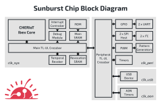
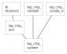
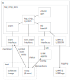

# Sunburst Chip

**Sunburst Chip** is an open-source microcontroller chip design based around the CHERI-enabled [CHERIoT Ibex](https://github.com/microsoft/CherIoT-ibex) RISC-V core.

This repository hosts the logical design, design verification (DV) environment, and associated bare-metal test software for Sunburst Chip.
It has been put together by [lowRISC C.I.C.](https://lowrisc.org/)

Sunburst Chip is part of the [Sunburst Project](https://www.sunburst-project.org) funded by [UKRI](https://www.ukri.org/) / [DSbD](https://www.dsbd.tech/) under grant number 107540.

## Contents

Major sections below include:

- [Overview](#overview)
- [Dependencies](#dependencies)
- [Test software](#test-software)
- [Top-level Xcelium simulation](#top-level-xcelium-simulation)
- [Top-level Verilator simulation](#top-level-verilator-simulation)
- [Block-level Xcelium simulation](#block-level-xcelium-simulation)
- [Sonata XL development board](#sonata-xl-development-board)
- [Vendoring](#vendoring)
- [Porting OpenTitan IP](#porting-opentitan-ip)
- [Porting Other IP](#porting-other-ip)
- [Licence](#licence)

## Overview



Sunburst Chip combines the CHERIoT Ibex core with a useful selection of peripherals (among other bits) from the open-source [OpenTitan](https://github.com/lowRISC/opentitan) project, along with some bits from the open-source [Sonata](https://github.com/lowRISC/sonata-system) project.
The [OpenTitan Documentation](https://opentitan.org/book) is a good reference for these peripherals.
They have been imported and patched using a vendoring process defined by files in the vendor sub-directory and enacted by [vendor.py](util/vendor.py).
Note when reading OpenTitan documentation that some OpenTitan-specific features such as alerts and integrity generation have been stripped out for Sunburst Chip using the vendoring patch mechanism.

Much of the verification environment has also been ported from OpenTitan, including top-level (whole-system) and block-level (components in isolation) tests, with some of the complexity stripped out.
The top-level tests are the more interesting for Sunburst Chip, as the blocks themselves are relatively unchanged from their OpenTitan counterparts compared with the wider system.
These top-level tests are mostly integration-focused, ensuring that system-level connections and interactions work as intended.
More comprehensive testing of each block is left to block-level DV, where it is easier and faster.

### Tops

There are three methods of exercising the design as a whole:

- Simulation using **Xcelium** - for Design Verification (DV) testing using a UVM environment.
- Simulation using **Verilator** - for fast and free functional testing.
- (Coming soon) **FPGA** instantiation using a **Sonata XL** board - for physical testing.

These each use a different top-level module.
Each top-level instantiates the common system (or a module that does), but connects it to a different support environment.



The **Xcelium DV testbench** [*tb.sv*](hw/top_chip/dv/tb/tb.sv) is the only one to instantiate the ASIC-style [*top_chip_asic.sv*](hw/top_chip/rtl/top_chip_asic.sv) which itself instantiates the common system.
The **Verilator testbench** is light-weight by comparison, lacking UVM environment and using simpler connections to the system, but keeping some interfaces for test-status and logging output.
The **Sonata XL top-level** instantiates FPGA clocking primitives and maps the limited ports of the design to the many available on the board.

### Top-level DV Environment

Full DV simulation of the system is the more complicated of the execution options.
There are many components involved and many different interfaces between the system under test and the surrounding DV environment.
Tests involve coordination between the embedded software running in the core and the UVM virtual sequence (vseq) orchestrating the wider DV environment.
Some tests, usually those involving external I/O, use custom vseq's to randomise, configure, load, stimulate, check, and terminate.
Other tests manage with only the base vseq to load the test-specific software into memory and terminate the simulation when signalled by the core.



A typical top-level test with a custom vseq may operate as follows:

- The **vseq** randomises test parameters, initialises SRAM memory with test software, overwrites software parameters with randomised versions, configures relevant UVM agents with test parameters, waits for system reset, enables UVM agent, waits for status updates from the core.
- The **test software** starts running on the simulated core, drives output transactions, checks input transactions driven by UVM agents, reports fail-status to the testbench if a check fails, reports done-status when finished.
- The **vseq** checks transactions received by UVM agents, terminates the simulation early if one of these checks fails or fail-status is reported by test software, or terminates the simulation normally if done-status is reported and all checks complete.

Top-level DVsim tests and test sets are defined in [*top_chip_sim_cfg.hjson*](hw/top_chip/dv/top_chip_sim_cfg.hjson).
Each test is primarily defined as a combination of a test program and a vseq.
Optionally, additional plusarg parameters can be specified.
These tests can also be grouped together into regression sets for easy use.

### Key TODOs

Some parts of Sunburst Chip are currently using temporary workarounds that must be removed/replaced before any tapeout.
Key pre-tapeout actions include (but are not be limited to):

- Implement a true random number generator
  - Currently, pseudo-random numbers are generated in `dif_rv_core_ibex_read_rnd_data` due to the lack of true random numbers.
  - May want to replicate the interface in [OpenTitan `rv_core_ibex`](https://opentitan.org/book/hw/ip/rv_core_ibex/doc/registers.html#rnd_data) for software compatibility.
- Implement a real reset and clock manager.
  - Currently, there are only simulation and FPGA-specific implementations.
- Implement top-level tests for all blocks for which performing integration testing makes sense.
  - Currently, only some key blocks have top-level tests defined in [*top_chip_sim_cfg.hjson*](hw/top_chip/dv/top_chip_sim_cfg.hjson).
- Triage the many TODOs throughout the codebase.

## Dependencies

[FuseSoC](https://github.com/olofk/fusesoc) is used to handle hardware related build tasks.
It can build [Verilator](https://verilator.org/) simulations directly and is used by the [DVsim](https://opentitan.org/book/util/dvsim) tool to generate file lists that DVsim uses to build simulations.
We use a [lowRISC specific fork of FuseSoC](https://github.com/lowRISC/fusesoc/tree/ot-dev) (which was created to handle primitive generation in the early days of OpenTitan).
DVsim itself also has various Python dependencies.
Pip can be used with the `python-requirements.txt` file to install FuseSoC and the DVsim dependencies.
The version in this repository is just a copy of the OpenTitan file, so likely contains extra dependencies that aren't required.
You may wish to install the dependencies in a virtual environment to isolate them from the rest of your system.
Python 3.9 or higher is required.

Some packages that you'll need to install to set up the Python environment:

- libxml2-dev
- libxslt-dev
- Cargo, which you can install using [rustup](https://rustup.rs/)

Python environment setup:
```sh
python3 -m venv sunburst-py-venv
source sunburst-py-venv/bin/activate
pip3 install -U pip "setuptools<66.0.0"
pip3 install -r python-requirements.txt
```

It is strongly recommended you build Verilator from source as packaged versions are often very out of date.
Verilator v5.026 was used when writing this README.
Instructions to do this can be found in the [Verilator documentation](https://verilator.org/guide/latest/install.html).

### Nix environment

There is a Nix environment available to build the Sunburst simulator and software.
We recommend using [Zero to Nix](https://zero-to-nix.com/start/install/) to install Nix.
You should set yourself up as a trusted user to use the Nix cache by adding the following line to `/etc/nix/nix.conf`:
```
trusted-users = root @sudo
```

Then there are multiple things you can do in Nix:
```sh
# Build the Verilator simulator
nix build .#sunburst_simulator -L
# Build the software
nix build .#sunburst_device_software -L
nix build .#sunburst_baremetal_software -L
# Run some smoke tests
nix build .#test_simulator -L
```

The benefit of using Nix is that you don't need to set up a local Python environment or acquire your own version of CHERIoT LLVM.
Nix build automatically stores everything in the Nix store so you won't see the USB and UART logs in the current directory.
If you need to inspect the logs you can enter a Nix shell.
```sh
# Enter the Nix shell
nix develop .#test_simulator -L
```
You can look through the printed log and find lines starting with `sunburst_baremetal_software> -- Installing: /nix/store/`.
Once inside the Nix shell you can run the software found using the path you found:
```sh
# Once inside the Nix shell you can run the simulator using the software built in the Nix store
sunburst_simulator -E /nix/store/<magic-hash>-sunburst_baremetal_software/bin/chip_check
cat uart0.log
```

## Test software

Test software is built **by the user** using CMake and [CHERIoT LLVM](https://github.com/CHERIoT-Platform/llvm-project).
It is **not automatically built** as part of running a simulation or building an FPGA bitstream.

There are currently two Sunburst Chip software ecosystems in this repository:

- *sw/* - ported OpenTitan top-level bare-metal test software.
- *scratch_sw/* - historical bare-metal software.

Future DV work is expected to be done in *sw/*, now that it exists.

### Build *sw/*

All *sw/* ported OpenTitan test software can be built using the following commands:

```sh
# -- Build *sw/* software --
# Run from the project root directory.
# NOTE: A suitable CHERIoT toolchain must be available on your path
#       or specified by the `CHERIOT_LLVM_BIN` environment variable.

# export CHERIOT_LLVM_BIN=/path/to/cheriot-llvm/bin
cmake -B sw/device/build -S sw/device  # once
cmake --build sw/device/build  # always
```

### Build *scratch_sw/*

All *scratch_sw/* test software can be built using the following commands:

```sh
# -- Build *scratch_sw/* software --
# Run from the project root directory.
# NOTE: A suitable CHERIoT toolchain must be available on your path
#       or specified by the `CHERIOT_LLVM_BIN` environment variable.

# export CHERIOT_LLVM_BIN=/path/to/cheriot-llvm/bin
cmake -B scratch_sw/bare_metal/build -S scratch_sw/bare_metal  # once
cmake --build scratch_sw/bare_metal/build  # always
```

### Run

See the sections on top-level simulation for information on how to run these test programs as part of a simulation.

Please note that presently the following USBDEV tests work only in Xcelium simulation and do not work with Verilator; this is under investigation.

```text
usbdev_config_host_test
usbdev_test
usbdev_stream_test
usbdev_mixed_test
usbdev_iso_test
```

## Top-level Xcelium simulation

The primary simulator for running top-level tests is Xcelium, via DVsim.

Note that DVsim does not build the test software for you.
It must have already been compiled using the instructions in the [Test software section](#Test-software) before you call DVsim.

All top-level DVsim tests and test sets are defined in [*top_chip_sim_cfg.hjson*](hw/top_chip/dv/top_chip_sim_cfg.hjson).

### Build & run

The **`smoke` regression test set** can be built and run under Xcelium using the following commands:

```sh
# -- Build and run top-level `smoke` regression set using Xcelium --
# Run from the project root directory.
# NOTE: test software must have already been built beforehand and Xcelium
#       must be available on your path.
hw/vendor/lowrisc_ip/util/dvsim/dvsim.py hw/top_chip/dv/top_chip_sim_cfg.hjson -i smoke
```

**Single tests** can be specified in the same way, such as `usbdev_vbus_test`:

```sh
# -- Build and run the `usbdev_vbus_test` top-level test using Xcelium --
# Run from the project root directory.
# NOTE: test software must have already been built beforehand and Xcelium
#       must be available on your path.
hw/vendor/lowrisc_ip/util/dvsim/dvsim.py hw/top_chip/dv/top_chip_sim_cfg.hjson -i usbdev_vbus_test
```

You can **increase the number of times each test is run** using the `-rx <multiplier>` option.
For example, `... -i smoke -rx 10` to run the `smoke` regression set 10 times.

**All tests** can be built and run simply by specifying `all` instead of a regression set or test name:

```sh
# -- Build and run all top-level tests 10 times using Xcelium --
# Run from the project root directory.
# NOTE: test software must have already been built beforehand and Xcelium
#       must be available on your path.
hw/vendor/lowrisc_ip/util/dvsim/dvsim.py hw/top_chip/dv/top_chip_sim_cfg.hjson -i all -rx 10
```

### Output

DVSim provides an overall regression report at the end, which should report the number of tests that passed and failed.

Artefacts from a test run are put into a sub-directory of the *scratch/* directory.
The exact location will follow the format `scratch/top_chip_asic.sim.xcelium/<branch>/<seed>.<test>/latest/`.
Typical artefacts include:

- *trace_core_00000000.log* - The instruction trace.
- *uart0.log* - The output from uart0.
- *run.log* - The log from the simulation run.
- *waves.shm* - The wave trace (only present when DVsim is run with `-w shm`).


Additional output, useful for debugging, can be generated using some optional arguments:

- For **waveform output**, add `-w shm` (SHM file) or `-w vcd` (uncompressed VCD file).
- For **increased UVM verbosity**, add `-v m` (medium) or `-v h` (high).

## Top-level Verilator simulation

Verilator can run top-level tests or other programs that do not require UVM agents, other parts of the full DV testbench (e.g. usbdev tests), or 4-state (0/1/Z/X) simulation.
It runs faster than Xcelium and does not require a paid licence, making it handy for developing the core digital logic of the system.
However, it does have limitations, particularly when it comes to external interfaces.
It lacks UVM, and as such has to run without most of the DV environment required to check and drive many of the external interfaces.
It also only supports 2-state simulation (0/1), lacking the high-impedance (Z) and undefined (X) states, and so cannot simulate the more complex electrical behaviour seen on multi-controller external buses (e.g. I^2C).

Note that FuseSoC (the tool used below to build Verilator) does not build the test software for you.
It must have already been compiled using the instructions in the [Test software section](#Test-software) before you run the simulation.

### Build

A Verilator simulator executable for Sunburst Chip can be built using the following commands:

```sh
# -- Build Verilator simulator from *top_chip_verilator.sv* --
# Run from the project root directory.
NUM_CORES=4
fusesoc --cores-root=. run \
  --target=sim --tool=verilator --setup \
  --build lowrisc:sunburst:top_chip_verilator \
  --verilator_options="-j $NUM_CORES" \
  --make_options="-j $NUM_CORES"
```

To enable instruction tracing add `+define+RVFI` to the `verilator_options` switch in the command above.

### Run

Programs can be run with the resulting executable using the following command:

```sh
# -- Run `usbdev_vbus_test` using a Verilator simulator we built earlier --
# Run from the project root directory.
# NOTE: test software must have already been built beforehand.
build/lowrisc_sunburst_top_chip_verilator_0/sim-verilator/Vtop_chip_verilator \
  -E sw/device/build/tests/usbdev_vbus_test
```

### Output

Unlike DVsim, the simulation output files end up in the directory the executable was called from.

For most test programs, you should see something in the resulting *uart0.log* or *usb0.log* files.
The simulation should terminate itself with the final output looking something like this:

```log
- ../src/lowrisc_sunburst_top_chip_verilator_0/top_chip_verilator.sv:217: Verilog $finish
Received $finish() from Verilog, shutting down simulation.

Simulation statistics
=====================
Executed cycles:  154539
Wallclock time:   0.789 s
Simulation speed: 195867 cycles/s (195.867 kHz)
```

If instruction tracing was enabled *trace_core_00000000.log* will contain a full instruction trace.

Add the `-t` switch to output a wave trace file in *sim.fst* which can be viewed with [gtkwave](https://gtkwave.sourceforge.net/).
Note, running with wave tracing enabled can significantly increase the runtime of the simulation.
You can use the provided save file to see the GPIO output and the PC of the processor:

```sh
# -- View waves --
# Run from the project root directory.
gtkwave util/gpio_and_pc.gtkw
```

## Block-level Xcelium simulation

Block-level DV for all of the IP blocks vendored from OpenTitan can also be run using DVsim.
Many blocks default to running using VCS, but they can be forced to use Xcelium using the `-t xcelium` option.
The full regression (called nightly) for each of the blocks can be run using Xcelium with these commands:

```sh
# -- Build and run block-level tests using Xcelium --
# Run all the below from the project root directory.
# Run aon_timer regression
hw/vendor/lowrisc_ip/util/dvsim/dvsim.py hw/vendor/lowrisc_ip/ip/aon_timer/dv/aon_timer_sim_cfg.hjson -i nightly --max-parallel 32 --tool xcelium
# Run gpio regression
hw/vendor/lowrisc_ip/util/dvsim/dvsim.py hw/vendor/lowrisc_ip/ip/gpio/dv/gpio_sim_cfg.hjson -i nightly --max-parallel 32 --tool xcelium
# Run i2c regression
hw/vendor/lowrisc_ip/util/dvsim/dvsim.py hw/vendor/lowrisc_ip/ip/i2c/dv/i2c_sim_cfg.hjson -i nightly --max-parallel 32 --tool xcelium
# Run pattgen regression
hw/vendor/lowrisc_ip/util/dvsim/dvsim.py hw/vendor/lowrisc_ip/ip/pattgen/dv/pattgen_sim_cfg.hjson -i nightly --max-parallel 32 --tool xcelium
# Run pwm regression
hw/vendor/lowrisc_ip/util/dvsim/dvsim.py hw/vendor/lowrisc_ip_main/ip/pwm/dv/pwm_sim_cfg.hjson -i nightly --max-parallel 32 --tool xcelium
# Run rv_timer regression
hw/vendor/lowrisc_ip/util/dvsim/dvsim.py hw/vendor/lowrisc_ip/ip/rv_timer/dv/rv_timer_sim_cfg.hjson -i nightly --max-parallel 32 --tool xcelium
# Run spi_host regression
hw/vendor/lowrisc_ip/util/dvsim/dvsim.py hw/vendor/lowrisc_ip_main/ip/spi_host/dv/spi_host_sim_cfg.hjson -i nightly --max-parallel 32 --tool xcelium
# Run uart regression
hw/vendor/lowrisc_ip/util/dvsim/dvsim.py hw/vendor/lowrisc_ip/ip/uart/dv/uart_sim_cfg.hjson -i nightly --max-parallel 32 --tool xcelium
# Run usbdev regression
hw/vendor/lowrisc_ip/util/dvsim/dvsim.py hw/vendor/lowrisc_ip/ip/usbdev/dv/usbdev_sim_cfg.hjson -i nightly --max-parallel 32 --tool xcelium
```

Like the top-level DVsim tests, artefacts end up under *scratch/* and additional output can be generated using the `-w shm` and `-v h` options.

## Sonata XL development board

Sonata XL is an FPGA-based development board developed by [NewAE Technology Inc.](https://www.newae.com/).
It is a larger sibling of the more common Sonata development board and is intended for emulating sunburst-chip.
It features an upgraded FPGA and the addition of two 80-pin board-to-board connectors.
The FPGA in question is an AMD Artix(tm) 7 **XC7A200T**.
This features over four-times the logic cells and memory, and twice the I/O of the XC7A50T used on the Sonata board.

Sonata XL is an open-source design, like the Sonata board it is based on.
As of writing, the design files (incl. schematic printout) for Sonata XL can be found in the [`sonata-a200` sub-directory of the sonata-pcb repository](https://github.com/newaetech/sonata-pcb/tree/main/sonata-a200).
Unlike the Sonata board, Sonata XL boards are not generally available for purchase.

The top-level module for Sonata XL builds is *top_chip_sonata_xl.sv*.
This modules instantiates the common system, provides a starting partial mapping of the system I/O to some of the FPGA I/O and associated onboard headers/devices, and uses FPGA primitives for basic clock and reset generation.

Unfortunately, the core clock had to be significantly reduced in order to get a reliably timing-clean bitstream build.
This clock frequency may be able to be increased with some tweaking of the build and improvements to timing-critical logic paths.
Happily, the other clocks (`peri`pheral, `usb`, `aon`) are able to be run at their intended frequencies, avoiding baud rate issues and the like on the external interfaces.

Note that FuseSoC (the tool used below to build an FPGA bitstream) does not build the test software for you.
It must have already been compiled using the instructions in the [Test software section](#Test-software) before you run the simulation.

At present, **the only way to load software is to build it into the bitstream**.
This is controlled with the `--SRAMInitFile` argument to `fusesoc`.
Sunburst Chip currently lacks a debug module for loading a program into SRAM while live as Sonata does.
It also (for now) lacks a bootloader, and so cannot load a program from onboard Flash.

### Dependencies

FPGA bitstream builds require AMD Vivado to be installed.
This is free for the XC7A200T device used on Sonata XL.
Please find it on AMD's website.

The remaining utilities are optional:

- openFPGALoader: install with `sudo apt install openfpgaloader` then setup udev USB rules as described in the (FPGA development documentation for sonata-system)[https://github.com/lowRISC/sonata-system/blob/main/doc/dev/fpga-development.md].
- uf2conv: install with `python3 -m pip install git+https://github.com/makerdiary/uf2utils.git`.
- picocom: install with `sudo apt install picocom`.

### Build

A Sunburst Chip bitstream for Sonata XL can be built using FuseSoC and Vivado using the following command:

```sh
# -- Build Sonata XL FPGA bitstream from *top_chip_sonata_xl.sv* --
# Run from the project root directory.
# NOTE: Vivado must be available on your path.
fusesoc --cores-root=. run --target=synth --setup --build lowrisc:sunburst:top_chip_sonata_xl \
  --SRAMInitFile=$PWD/scratch_sw/bare_metal/build/checks/blink.vmem
```

### Load

There are three ways to load a bitstream onto the FPGA of Sonata XL.

- Over USB to the onboard FTDI USB-to-JTAG interface.
  - Easy, fast, but will have to load again after a power-cycle of the board.
  - Good for active development of the design.
- Using an AMD/Xilinx JTAG programmer of your own.
  - No additional dependencies (use Vivado), but also will have to load again after a power cycle.
  - Note: DIP switches on the underside of the board must be changed in order to use the JTAG headers.
- Saving a bitstream converted to UF2 format to the onboard flash via the onboard RP2040.
  - More time consuming, but will be retained across power-cycles.
  - Good for development of the software or for demos.
  - Can store up to three bitstreams, selectable using the onboard "Bitstream" switch.

A bitstream can be directly loaded over USB using the following command:

```sh
# -- Program the Sonata XL FPGA with a bitstream we built earlier --
# Run from the project root directory.
# NOTE: host must be connected to Sonata XL via the "Main USB" connector and
#       on Linux the required USB rules must have been applied.
openFPGALoader -c ft4232 build/lowrisc_sunburst_top_chip_sonata_xl_0/synth-vivado/lowrisc_sunburst_top_chip_sonata_xl_0.bit
```

A standalone AMD/Xilinx JTAG programmer may be able to be used from Vivado or using a command similar to that above.

Non-volatile loading using Sonata firmware on the RP2040 can be done using the following commands:

```sh
# -- Load onboard flash with a bitstream we built earlier --
# Run from the project root directory.
# NOTE: host must be connected to Sonata XL via the "Main USB" connector and
#       the onboard RP2040 must be running Sonata firmware.

# Convert bitstream to UF2 format for the RP2040 firmware.
uf2conv -b 0x00000000 -f 0x6ce29e6b build/lowrisc_sunburst_top_chip_sonata_xl_0/synth-vivado/lowrisc_sunburst_top_chip_sonata_xl_0.bit -co sonata-xl.bit.slot1.uf2
uf2conv -b 0x10000000 -f 0x6ce29e6b build/lowrisc_sunburst_top_chip_sonata_xl_0/synth-vivado/lowrisc_sunburst_top_chip_sonata_xl_0.bit -co sonata-xl.bit.slot2.uf2
uf2conv -b 0x20000000 -f 0x6ce29e6b build/lowrisc_sunburst_top_chip_sonata_xl_0/synth-vivado/lowrisc_sunburst_top_chip_sonata_xl_0.bit -co sonata-xl.bit.slot3.uf2

# Load into slot1 of the connected Sonata XL board.
# This should take half a minute or so.
# If you do not see a SONATA drive, you may need to update the RP2040 firmware
# (see https://github.com/lowRISC/sonata-system/releases).
cp sonata-xl.bit.slot1.uf2 "/media/$USER/SONATA/"
```

### Output

UART logging output can be received from the FTDI UART-to-USB interface.
This typically appears at `/dev/ttyUSB2`.
The default baud rate for test software is 1.5 MBd.

An example terminal utility is `picocom`, which can be used with the following command:

```sh
# -- Connect to Sonata XL UART --
# NOTE: host must be connected to Sonata XL via the "Main USB" connector.
picocom /dev/ttyUSB2 -b 1500000 --imap lfcrlf
# To quit: CTRL-a then CTRL-x
```

## Vendoring

Many IP blocks in the design and associated code have been imported from the Ibex, OpenTitan, and Sonata repositories using the 'vendor' flow.
The goal is to import select parts of the target repositories, optionally from a particular revision, and automatically apply local patches that make Sunburst Chip-specific changes.
The [*vendor.py*](util/vendor.py) script automates this process based on the *\*.vendor.hjson* configuration files in *hw/vendor*.
All the vendored code ends up in subdirectories under *hw/vendor*.

The vendor script can be re-run using the following command:

```sh
# -- Apply patches to vendored OpenTitan earlgrey_v1 IP --
# Run from the project root directory.
util/vendor.py --update --verbose hw/vendor/lowrisc_ip_earlgrey_v1.vendor.hjson
```

To **change the revision or the selection** being vendored, adjust the relevant *\*.vendor.hjson* file before re-running the vendor script.
A branch name can be specified instead of a specific revision in order to make the vendor script automatically pull the latest revision when run.
In such cases, the revision can be overridden using the `-Dupstream.rev=...` command line argument for patching without pulling newer versions.

### Creating patches

Modifying vendored code using patch files keeps the Sunburst-Chip-specific modifications cleanly separate from the base code and ensures they are not lost when re-vendoring.

Patch files can be created using `git`, although the filepaths inside will need adjusting.
Here is an example flow for the `spi_host`:

```sh
# Create a vendoring patch from unstaged local changes to `spi_host`
git diff -- hw/vendor/lowrisc_ip_main/ip/spi_host/ | sed 's|hw/vendor/lowrisc_ip_main/ip/spi_host/||g' > hw/vendor/patches/lowrisc_ip/spi_host/0001-Remove-Alerts.patch
```

## Porting OpenTitan IP

Modifying and integrating OpenTitan IP blocks and associated code is unfortunately not as easy as simply copying (or rather vendoring) it in, particularly for top-level verification.
Porting top-level DV elements such as UVM agents, virtual sequences (vseq), and test software for an OpenTitan block can take days to weeks depending on the complexity.
Factors include the complexity of the top-level DV for that block, applicable differences between OpenTitan and Sunburst Chip, and familiarity with the two projects.
Applicable differences from OpenTitan to Sunburst Chip currently include:

- reduced PLIC interrupt granularity (per cause -> per block),
- simplification of top-level DV environment and base classes,
- removal of security hardening such as Alerts and TL-UL bus Integrity checking,
- current lack of pinmux, and
- current lack of clock or reset managers (also means no sleep modes).

Here are some notes on common steps required when porting top-level DV for a block from OpenTitan to Sunburst Chip:

- RTL patches (already done for blocks present)
  - Create vendoring patches to remove: Alerts, Integrity checks (on inputs at least), adjust DV code in *hw/* to match Alert removal and new filepaths, and any other block-specific changes required.
- UVM agent integration (for I/O blocks)
  - Add and connect to the DUT the appropriate virtual interface (such as `spi_if`) in the testbench *hw/top_chip/dv/tb/tb.sv* for export using `uvm_config_db`.
    - This may require adding an enable signal if the DUT connections need to be shared with a DPI model.
    - OpenTitan has an additional level of interface in the form of [chip_if.sv](https://github.com/lowRISC/opentitan/blob/earlgrey_1.0.0/hw/top_earlgrey/dv/env/chip_if.sv), but this has been omitted to keep Sunburst Chip simpler.
  - Add a sequencer variable or array thereof to *hw/top_chip/dv/env/top_chip_dv_virtual_sequencer.sv*
  - Add an agent or array of agents to *hw/top_chip/dv/env/top_chip_dv_env.sv*.
    - Instantiate and register in `uvm_config_db` in the `build_phase()`.
    - Store handles to their sequencers into the virtual sequencer in the `connect_phase()`.
  - Add a randomised agent config in *hw/top_chip/dv/env/top_chip_dv_env_cfg.sv*.
    Initialise it in `initialize()`.
  - Add the agent to *hw/top_chip/dv/env/top_chip_dv_env.core*
  - Import the agent’s package in *hw/top_chip/dv/env/top_chip_dv_env_pkg.sv*
- Virtual sequence porting
  - Copy vseq into *hw/top_chip/dv/env/seq_lib/*
    - Check for any block-specific base vseq and copy that too.
  - Rename vseq to use Sunburst Chip top-level prefix `top_chip_dv_`.
    - Remember to update it in the `uvm_object_utils` call too.
  - Change `chip_sw_base_vseq` to `top_chip_dv_base_vseq` in `class ... extends` section.
  - Replace OpenTitan chip constants (such as `NUM_SPI_HOSTS`) with an equivalent in *hw/top_chip/dv/env/top_chip_dv_env_pkg.sv* or other appropriate package.
  - Prepend `p_sequencer.` to `cfg.*` usages.
  - Merge contents of task `cpu_init()` with the top of task `body()`.
  - Add `p_sequencer.ifs.peri_clk_if.wait_for_reset();` near the start of `body()`, if required.
    - Change clock interface from `peri_clk_if` if the block is driven by a different clock.
  - Replace `` `DV_WAIT `` with `wait`, removing any failure message (unfortunately).
  - Add the vseq to the lists in following files:
    - *hw/top_chip/dv/env/seq_lib/top_chip_dv_vseq_list.sv*
    - *hw/top_chip/dv/env/top_chip_dv_env.core*
    - *hw/top_chip/dv/top_chip_sim_cfg.hjson*
- Test program porting
  - Rework interrupt code (if any) to account for the PLIC only having one interrupt per block rather than per cause in each block.
  - Move macro-ified `irq_global_ctrl()` call (if any) to be inside `test_main()` rather than any sub-function to avoid interrupt-clearing side effects resulting from function returns compiled by the CHERIoT toolchain.
    - For information of the mechanics of interrupt-disabling backward sentries, see the "Sealed capabilities" section of the CHERIoT ISA.

## Porting Other IP

Integrating non-OpenTitan IP blocks is a less well defined process due to the unknown origin and style.
Using an OpenTitan block as an example case may help, depending on the situation.
For I/O peripherals, the two main aspects that will probably require the most integration effort are connecting the internal register interface and creating an I/O agent for verifying the external interface.

### Internal TL-UL

Sunburst Chip and OpenTitan use the [SiFive TileLink Uncached Lightweight (TL-UL) bus](https://static.dev.sifive.com/docs/tilelink/tilelink-spec-1.7-draft.pdf) for internal interconnect.
Here is a brief comparison of TL-UL to other buses as quoted from the [OpenTitan TL-UL documentation](https://opentitan.org/book/hw/ip/tlul/index.html#description):

> TL-UL is a lightweight bus that combines the point-to-point split-transaction features of the powerful TileLink (or AMBA AXI) 5-channel bus without the high pin-count overhead.
> It is intended to be about on par of pin count with APB but with the transaction performance of AXI-4, modulo the following assumptions.
>
> - Only one request (read or write) per cycle
> - Only one response (read or write) per cycle
> - No burst transactions

[OpenTitan's TL-UL](https://opentitan.org/book/hw/ip/tlul/index.html) is also augmented with `a_user` and `d_user` side-channels used for Integrity checking.
This integrity checking is not required in Sunburst Chip, though redundant fragments of logic may remain in places.

Sunburst Chip follows OpenTitan in using the terms "host" / "device" instead of the fraught terms "master" / "slave".

The TL-UL crossbars `xbar_main` and `xbar_peri` in Sunburst Chip are currently generated using [tlgen](https://opentitan.org/book/util/tlgen/index.html).

The OpenTitan register generation tools [reggen/regtool](https://opentitan.org/book/util/reggen/index.html) are not currently in use in Sunburst Chip.

#### Creating TL-UL adapters

A requirement for integrating most IP blocks into Sunburst Chip is that they have a TL-UL interface, whether natively or using an adapter.
**TL-UL bus primitives** are provided in the [lowRISC IP library](hw/vendor/lowrisc_ip/ip/tlul) to help with this.
Key primitives for adding a TL-UL interface to an IP block include:

- [`tlul_adapter_host`](hw/vendor/lowrisc_ip/ip/tlul/rtl/tlul_adapter_host.sv)
  - converts between TL-UL and a generic req/grant/rvalid memory host interface
- [`tlul_adapter_sram`](hw/vendor/lowrisc_ip/ip/tlul/rtl/tlul_adapter_sram.sv)
  - converts between TL-UL and a generic req/grant/rvalid memory device interface
- [`tlul_adapter_reg`](hw/vendor/lowrisc_ip/ip/tlul/rtl/tlul_adapter_reg.sv)
  - converts between TL-UL and a generic ren/wen/busy register device interface
- [`tlul_fifo_async`](hw/vendor/lowrisc_ip/ip/tlul/rtl/tlul_fifo_async.sv)
  - connects TL-UL interfaces either side of a Clock Domain Crossing (CDC)

An example of using one of these primitives to connect a non-OpenTitan block to a TL-UL bus exists in [Sonata system](https://lowrisc.github.io/sonata-system/), also part of the Sunburst Project.
Sonata system is designed for the [Sonata board](https://github.com/newaetech/sonata-pcb), an FPGA-based development board.
The FPGA in question, a Xilinx/AMD Artix 7 A50T, features an [XADC](https://docs.amd.com/r/en-US/ug480_7Series_XADC) Analog to Digital Converter hard-IP block with a Dynamic Reconfiguration Port (DRP) for register access.
Some manner of connecting the XADC DRP interface to the system TL-UL bus was desired to allow runtime configuration and measurement.
Of the lowRISC TL-UL primitives, `tlul_adapter_sram` was identified as being most like the DRP interface on the non-TL side.
This primitive was combined with some custom request rejection logic to create [`xadc_adapter`](https://github.com/lowRISC/sonata-system/blob/main/rtl/ip/xadc/rtl/xadc_adapter.sv) to translate TL-UL for this DRP device.
This adapter and a Vivado-generated XADC instantiation (with many parameters) were combined in the [`xadc`](https://github.com/lowRISC/sonata-system/blob/main/rtl/ip/xadc/rtl/xadc.sv) wrapper.
This allowed the XADC to be accessed like any other peripheral without having to write vast amounts of TL-UL conversion logic.

An example of adapting an IP block *without* using one of the lowRISC TL-UL adapter primitives can also be found in the Sonata system HyperRAM controller.
The HyperRAM device itself is an onboard memory module that uses the HyperBus interface.
[OpenHBMC](https://github.com/OVGN/OpenHBMC) is an open-source HyperBus controller IP suitable for use with the FPGA on the Sonata board, but it features an AXI4 bus for host communications rather than TL-UL.
The [`hbmc_tl_top`](https://github.com/lowRISC/sonata-system/blob/main/rtl/ip/hyperram/rtl/hbmc_tl_top.sv) module, derived from [`hbmc_axi_top`](https://github.com/OVGN/OpenHBMC/blob/master/OpenHBMC/hdl/hbmc_axi_top.v), provides a TL-UL interface rather than an AXI4 interface by tweaking the logic and using some smaller primitives.
This approach may not be as clean as using an adapter, but it is more targeted and may require fewer logic/memory resources.
It also may provide better performance, which for an interface to program/data memory is quite important.

### External I/O

When it comes to monitoring/driving the external interface of I/O peripherals, there are technically two approaches used in OpenTitan: UVM agents, and DPI models.
At present, only the `usbdev` block uses a DPI-model for verification (as well as logging).
Non-`usbdev` OpenTitan I/O peripherals interact with UVM agents for verification, though there is also a UART DPI model for logging purposes.
Other approaches are always an option if a way can be found to integrate them with the existing verification environment.
Which approach to choose if writing DV from scratch may depend on your previous experience and any existing resources.

## Licence

Unless otherwise noted, everything in the repository is covered by the [Apache License](https://www.apache.org/licenses/LICENSE-2.0.html), Version 2.0.
See the [LICENSE](https://github.com/lowRISC/sonata-system/blob/main/LICENSE) file for more information on licensing.
